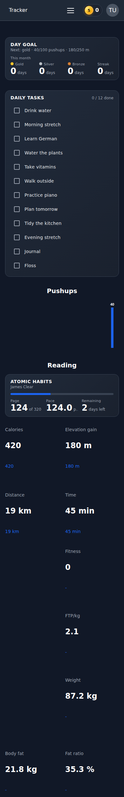
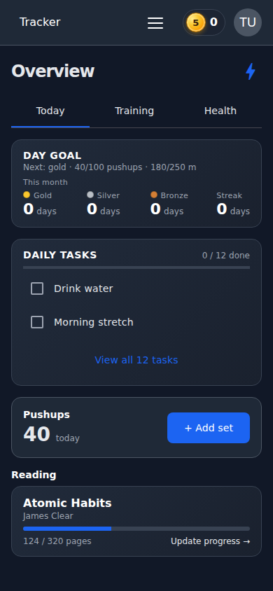

# iPhone dashboard redesign

Actual screenshots of the running application, captured with Playwright and
Chromium mobile emulation. These are browser renders, not design mockups or
screenshots from physical iPhones.

## Before and after

The same populated scenario has 12 daily tasks, 40 pushups today, a book at page
124 of 320, and a ride. At a 390 × 844 viewport, the original stacked dashboard
was 2,488 pixels tall; the redesigned Today view fits within the viewport.

| Before | Today |
| --- | --- |
|  |  |

## Other views

- [Training](iphone-training.png)
- [Health](iphone-health.png)
- [Smaller iPhone viewport, 375 × 667](iphone-se-overview.png)
- [Desktop, 1440 × 1000](desktop-overview.png)
- [Ride achievement collapsed](iphone-podium-collapsed.png)
- [Ride achievement expanded](iphone-podium-expanded.png)

Images are full-page captures. The smaller-iPhone image includes content below
the fold; the Add set button is asserted to be fully visible in its viewport.
The achievement screenshots use a separate fixture with historical segment
efforts and a new best effort.

The after screenshots are generated by `test/tests/mobile-dashboard.spec.ts`:

```sh
# From test/, with the test stack running:
npx playwright test mobile-dashboard.spec.ts
```

The test output includes fresh screenshots and checks task expansion,
completion persistence, quick logging, tab navigation, period selection,
viewport fit, and achievement disclosure.
